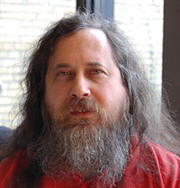

## History of R

R is a programming language that was created for statistical computing and graphics. It is a GNU
project and it is considered to be a different implementation of the S programming language which
was created by John Chambers. 

R was developed by Robert Genteleman and Ross Ihaka and it was named after their first names and as 
a play on the name S. The initial version was realeased in 1995. Nowadays, R is developed and 
maintained by the R Core team, member of which is John Chambers. 


## GNU Project {.smaller}

<div class="columns-2">
  

The GNU project was announced on 27 Sept 1983 by Richard Stallman at MIT. It is a free software,
mass collaboration project, aimed to give users the freedom to use software with the following
rights:

- Run software
- Share software (copy, distribute)
- study 
- modify

And therefore free software was created (free to imply freedom).
</div>

## Data Types {.build .smaller}

```{R}
typeof('Hello World')

typeof(5)

typeof(5L)

typeof(TRUE)
```

                                       Any more?

## Data Structures

